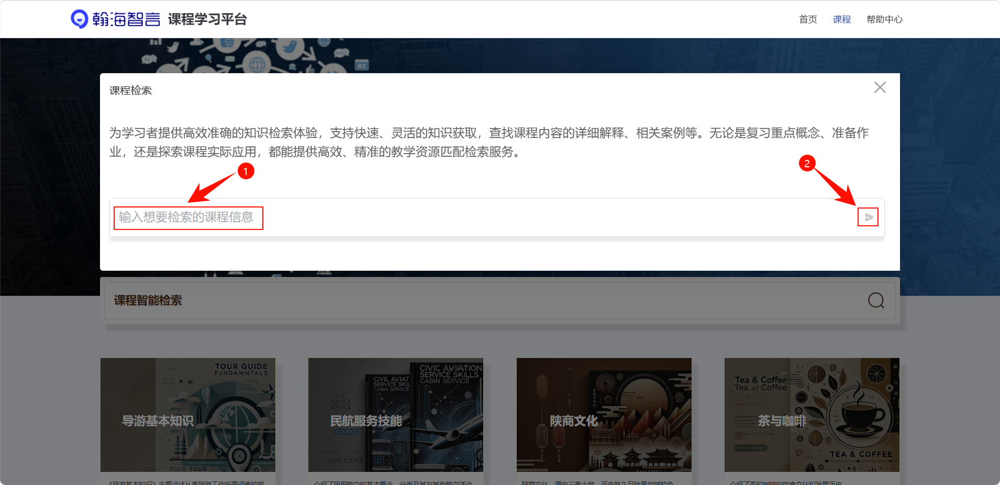
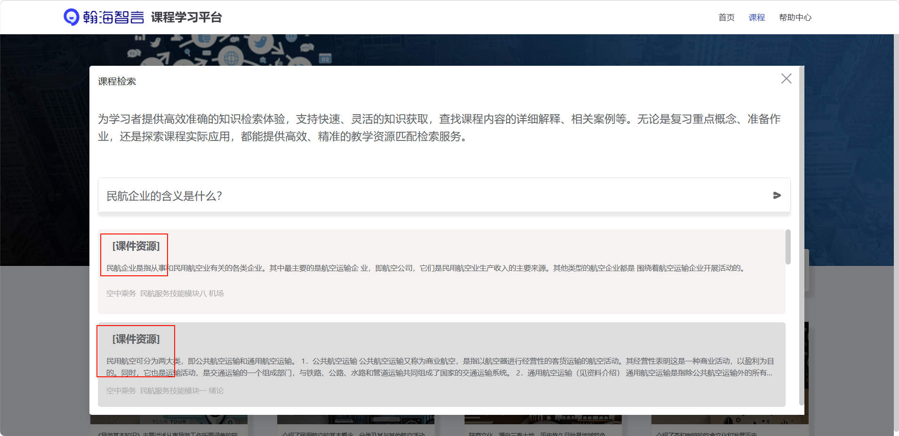
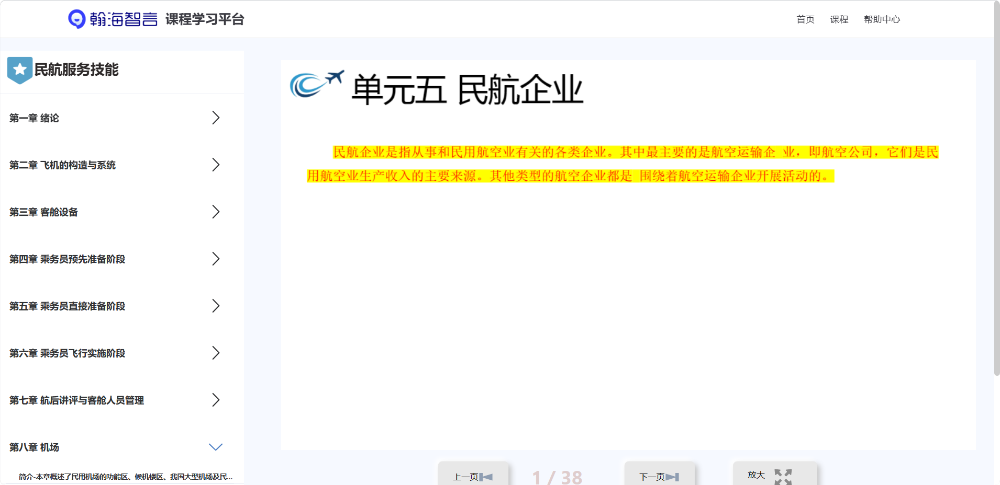
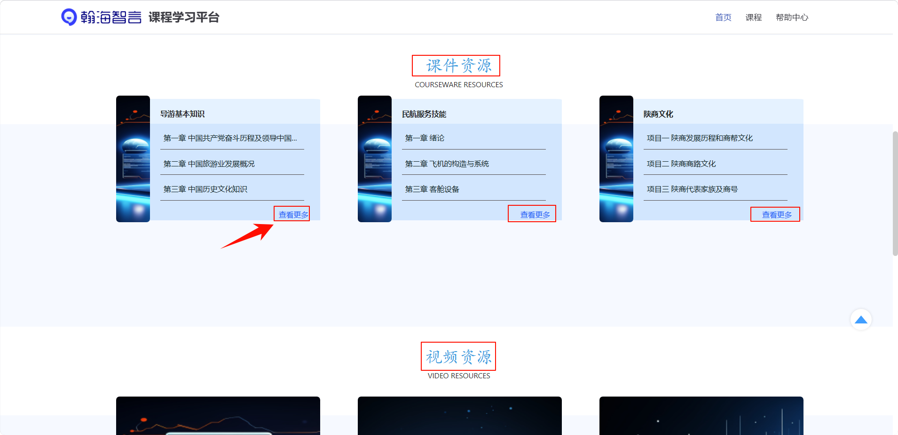
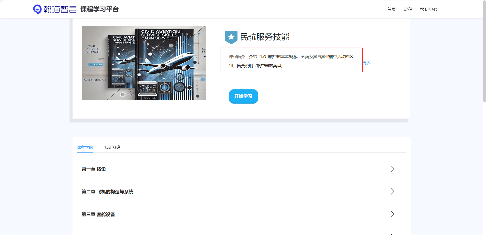

## How to Use Course Intelligent Search

 **Click on Course Intelligent Search on the homepage**  
     
   Course Intelligent Search on the course page  
     

   **Enter the keywords you want to search**  
   Click the send icon, and the system will provide course-related resources based on the keywords.  
     

   **Click on the search results**  
   You can directly access the course resources.  
     
   View the course resources.  
     

## How to Browse and Learn Courses

   **Scroll down on the homepage**  
   View the corresponding course resources, click "View More" to enter the course details page.  
     

   **Enter through the course page**  
   Click the course button to view all courses.  
     

   **View course details**  
   Click on the respective course to enter the course details page.  
     

   **Course details**  
   The course details page will display the course introduction.  
     
   Course outline, which can be expanded to view the specific content of each chapter.  
     
   Knowledge map, which can be set to display in 2D/3D.  
     

   **Chapter learning**  
   Click on the chapter title, such as "Chapter 1 Introduction" or "Chapter 2 Aircraft Structure and Systems", to expand the detailed content of that chapter for learning.  
     

   **View related resources**  
   Chapters may include text introductions, course teachings, experiment guides, experiment videos, images, and extended resources.  
     
   Click on the respective resource item to study, you can click on the previous page, next page, and zoom in on the page.  
     