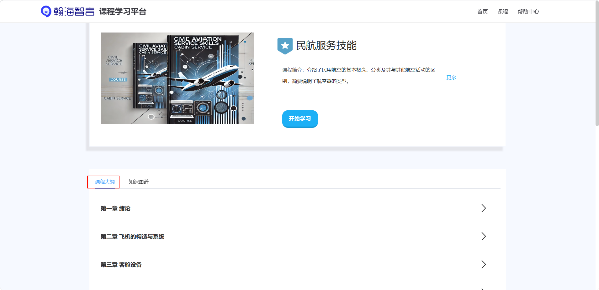

## 如何使用课程智能检索

 **点击首页的课程智能检索**  
     
   课程页的课程智能检索  
     

   **输入想要检索的关键词**  
   点击发送图标，系统将根据关键词提供与课程相关的资源。  
     

   **点击检索结果**  
   能够直接访问课程资源。  
     
   查看课程资源。  
     

## 如何浏览和学习课程

   **首页向下滑动进入**  
   查看对应的课程资源，点击"查看更多"，进入课程详情页面。  
     

   **课程页面进入**  
   点击课程按钮，查看全部课程。  
     

   **查看课程详情**  
   点击相应课程，进入到课程详情页面。  
     

   **课程详情**  
   课程详情页面会显示课程的简介。  
     
   课程大纲，可以展开查看各章节的具体内容。  
     
   知识图谱，可设置2D/3D显示。  
     

   **章节学习**  
   点击章节标题，如“第一章 绪论”或“第二章 飞机的构造与系统”，即可展开该章节的详细内容进行学习。  
     

   **查看相关资源**  
   章节内可能包含文字介绍、课程教学、实验指南、实验视频、图片以及扩展资源等。  
     
   点击相应的资源项进行学习，可点击上一页、下一页，页面进行放大。  
     

